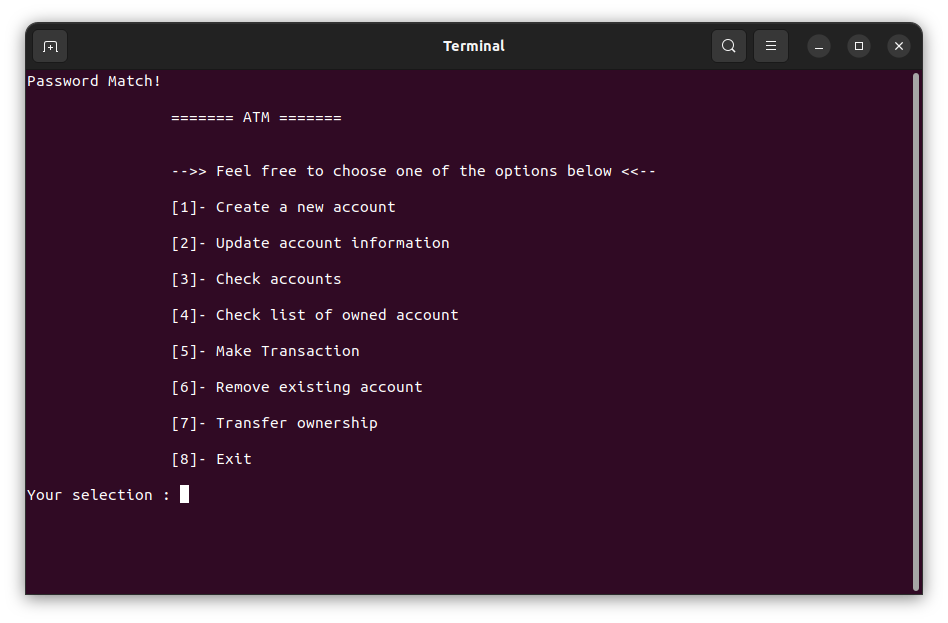

# Atm Management System

### Descriptif
_______
L'objectif de ce projet est de montrer que de la logique de programmation à été acquis et que je suis capable de m'adapter à un nouveaux langages. Pour cela je crée un programme de gestion basique en `langage C` pour une banque.


**Les utilisateurs peuvent effectuer les opérations suivantes :**
- Connexion et enregistrement d'utilisateur
- Créer un nouveau compte
- Vérifier les détails des comptes existants
- Mettre à jour les informations des comptes existants
- Supprimer des comptes existants
- Vérifier la liste des comptes détenus par l'utilisateur connecté
- Effectuer des transactions (retrait ou depot)

</img>

### Usage
_______
```go
make
./atm 
```

### Authors
_______
+ Fabien Olivier
