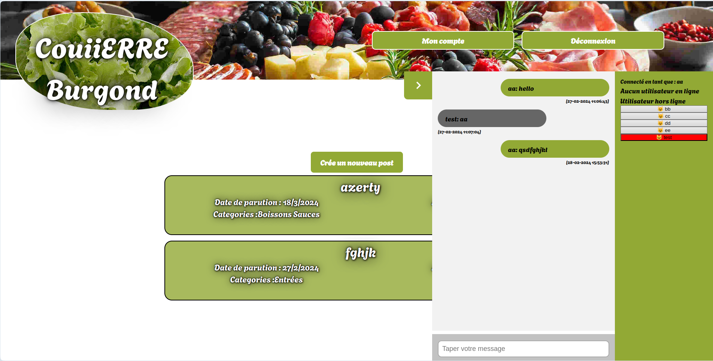

# REAL TIME FORUM

## 📝 Descriptif

Le projet consiste à créer un forum en one page ou les utilisateurs peuvent s'enregistrer, crée des posts et mettre des commentaires sur les posts, communiquer en temps réel via une connexion [websocket](https://en.wikipedia.org/wiki/WebSocket), couramment appeler "un chat de discussion". Les utilisateurs non connectés ne peuvent rien faire et n'accède à rien.



___
## ⚙️ Usage

```sh
go run ./cmd/main.go
```

___
## 🔗 Dépendences

Le serveur utilise la `version 18` de [golang](https://go.dev) et les librairies suivantes :<br>
- [go-sqlite3](https://github.com/mattn/go-sqlite3)
- [uuid](https://github.com/gofrs/uuid)
- [gorilla/websocket](https://pkg.go.dev/github.com/gorilla/websocket)
- [bcrypt](https://pkg.go.dev/golang.org/x/crypto/bcrypt)

Le front utilise du `javascript`.

___
## 🧑‍💻 Authors

+ Fabien OLIVIER
+ Jordan BOITRELLE

