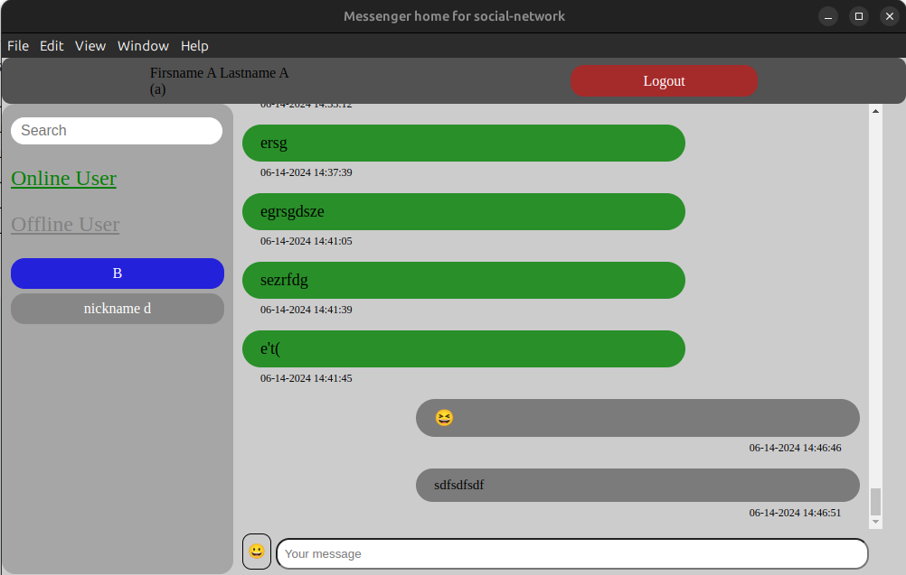
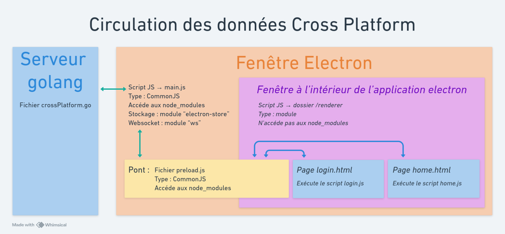

# Cross platform appimage

## 📝 Descriptif
Cross platform appimage est une application multiplateforme de chat de discussion avec les particularités suivantes :
- Un moyen de voir quels utilisateurs sont en ligne (capables de parler)
- un systéme de notification lorsque l'utilisateur reçoit un message
- une communication en temps réel entre les utilisateurs qui discutent
- Une section avec des emojis que les utilisateurs peuvent s'envoyer les uns aux autres.
- Un mode hors ligne qui permet de voir tous les messages de tous les utilisateurs (l'envois de message étant bloqué)
- Un moteur de recherche pour rechercher un message
</br></br>

**Images de l'application**
<table>
    <tr>
        <td></td>
        <td></td>
    </tr>
</table>
</br>

**Schéma qui représente la circulation des données au sein de l'aplication**


L'application est connecté au projet social-network et communique en temps réel avec le chat du projet social-network.

## ⚙️ Installation & usage
Placer vous dans le dossier `/cross-platform`

**Exécuter le programme manuellement en node.js**
```sh
npm i
npm start
```

**Crée l'exécutable de l'application**
```sh
npm run dist
```
Un fichier exécutable nommée `Z01_cross-platform-appimage` adapté à votre systéme d'exploitation sera build dans le dossier `/release` :
- `.AppImage` pour Linux
- `.dmg` pour Mac
- `.nsis` pour Windows

## 🔗 Dépendences
Le programme fonctionne en node.js `version 22.2.0` et utilise les modules npm `version 10.7.0` suivant : 
- [electron](https://www.npmjs.com/package/electron) ([site officiel](https://www.electronjs.org))
- [electron-store](https://www.npmjs.com/package/electron)
- [websocket ws](https://www.npmjs.com/package/ws)
- [electron-builder](https://www.npmjs.com/package/electron-builder)

## 🧑‍💻 Authors
- Fabien OLIVIER