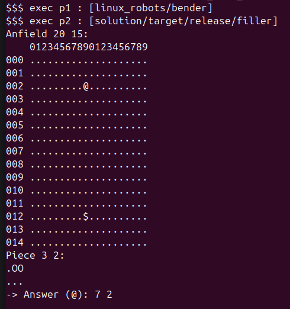
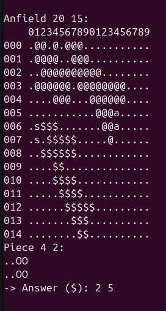
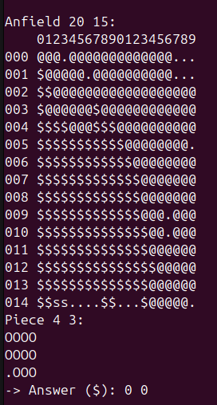
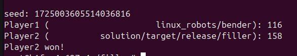

# FILLER

## 📝 Descriptif

Ce projets consiste à crée un programme qui va jouer à une jeux ressemblant au `Blockus`.</br>
Le but et que le programme réussisse à battre les robots (`bender`, `wall_e`, `h2_d2` et `terminator`)</br>
Pour télécharger le game_engine et les robots : [cliquer sur ce Lien](https://assets.01-edu.org/filler/filler.zip)</br>
Voici le sujet complet de l'exercice : [lien vers le sujet complet (github)](https://github.com/01-edu/public/tree/master/subjects/filler)

## 🎮 Le jeu
une seule régle : chaque pièce jouez doit être superposé sur 1 seul emplacement au moins d'une autre pièce de la même couleur.

- Le joueur `P1` est représenté par les piéces `@` et `a`, `a` representant la derniére piéce placé.
- Le joueur `P2` est représenté par les piéces `$` et `s`, `s` representant la derniére piéce placé. 

Le but est de réussir à placer le plus de pièces possible sur le plateau, chaque piéce representant un nombre différent de point. Les piéce sont généré aléatoirement par le programme `game_engine`.

Le jeu se termine lorsque plus aucune pièce ne peut être placée, et le joueur ayant le plus point gagne la partie.

**Image du projet**
<table align="center" width="95%">
    <tr>
        <td></td>
        <td></td>
        <td></td>
    </tr>
    <tr>
        <td colspan="3" align="center"></td>
    </tr>
</table>

___
## ⚙️ Installation & usage

Le projet est exécuté via [Docker](https://www.docker.com), assurez-vous [d'installer Docker](https://docs.docker.com/compose/install/) avant d'exécuter la commande de lancement.

Lancement du container est accées à la console du `Docker`. 
```sh
# Console de votre machine
cd docker_image
sudo docker build -t filler .
sudo docker run -v "$(pwd)/solution":/filler/solution -it filler
```

Build l'application dans la console du container `Docker`.
```sh
# Console Docker
cd solution
cargo build --release
cd ..
```

Executer le programme
```sh
# Console Docker
./linux_game_engine -f maps/map00 -p1 linux_robots/bender -p2 solution/target/release/filler
# L'option -f permet de choisir la map : "map00" (20 x 15), "map01" (40 x 30), "map02" (99 x 100)
# L'option -p1 et -p2 permet de choisir les joueurs : ici en P1 est mis un robot et en P2 le programme 
# Robot possible : "bender", "h2_d2", "wall_e", "terminator"
# L'option -q permet d'executer le programme en mode silencieux
# L'option -r permet d'executer le programme plus lentement (avec un throttle)
# L'option -t permet de modifier le delais d'attente (timeout qui est par defaut sur 10)
```
___
## 🔗 Dépendences

Le programme utilise [Rust](https://www.rust-lang.org/fr) avec la `version 1.79.0` de [cargo](https://www.rust-lang.org/fr)

___
## 🧑‍💻 Authors

+ Fabien OLIVIER

