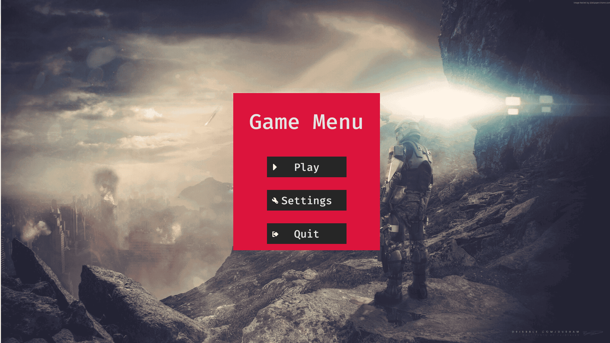
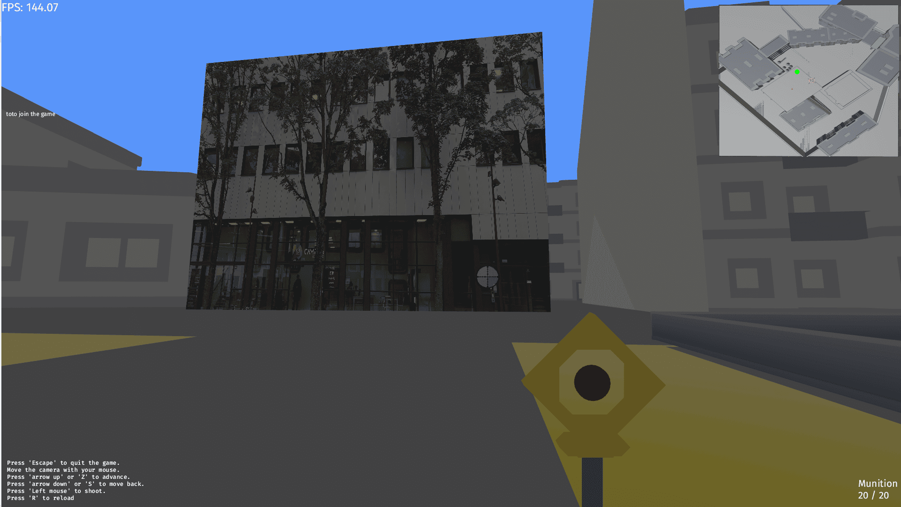

# MULTIPLAYER FPS

## 📝 Descriptif
Le projet consiste a crée un jeu multiplayer FPS type `Maze War` en protocole UDP ou les joueur peuvent ce connecté via leur PC et jouer en réseaux.


**Images du jeu**
<table align=center>
    <tr>
        <td></td>
        <td></td>
    </tr>
</table>

___
## ⚙️ Installation & usage

**Mise en route du serveur**
```sh
cargo run --bin server
```

Lien de téléchargement du client build : <a href="https://mega.nz/file/iCAFXQhQ#hkOWxJ9brvYbWxjQUbKX1wnw_R4_Bdl2B0oSItss8lk">Cliquer ici</a></br>
**Mise en route du client**
```sh
# Si besoin il faut rendre le fichier executable
chmod +x Multiplayer_FPS-x86_64.AppImage 

./Multiplayer_FPS-x86_64.AppImage 
```

___
## 🔗 Dépendances
Le programme utilise `Rust` avec la `version 1.79.0` de [cargo](https://www.rust-lang.org/fr) et les imports suivants :<br>  

- [bevy](https://crates.io/crates/bevy) version `0.14.2` : Framework pour le développement de jeux en Rust.  
- [bevy_rapier3d](https://crates.io/crates/bevy_rapier3d) version `0.27.0` : Moteur physique 3D pour Bevy, basé sur le moteur Rapier.  
- [local-ip-address](https://crates.io/crates/local-ip-address) version `0.6.3` : Permet de récupérer l'adresse IP locale.  
- [serde](https://crates.io/crates/serde) version `1.0.210` : Bibliothèque pour la sérialisation et désérialisation de données (avec `derive`).  
- [bincode](https://crates.io/crates/bincode) version `1.3.3` : Format de sérialisation binaire rapide et efficace.  
- [serde_derive](https://crates.io/crates/serde_derive) version `1.0.210` : Proc-macro pour générer du code pour la sérialisation/désérialisation avec `serde`.  
- [tokio](https://crates.io/crates/tokio) version `1.40.0` : Runtime asynchrone pour Rust, utilisé ici avec les fonctionnalités complètes (`full`).  
- [renet](https://crates.io/crates/renet) version `0.0.16` : Bibliothèque pour les réseaux orientés jeux.  
- [bevy_renet](https://crates.io/crates/bevy_renet) version `0.0.12` : Intégration de Renet avec Bevy.  

___
## 🧑‍💻 Authors
+ Fabien OLIVIER
+ Raphaël LOVERGNE 
+ Axelle FOUQUEMBERG
+ Rodolphe DAMANDE 
+ Jean-Frédéric NANGY
