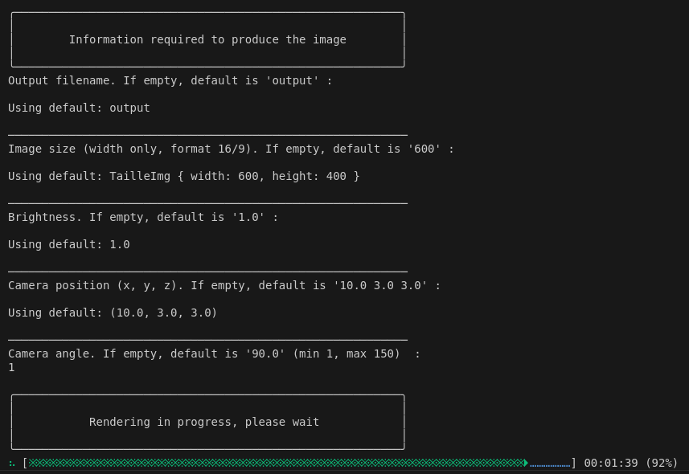
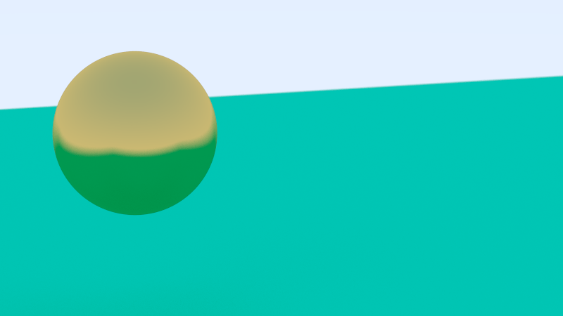
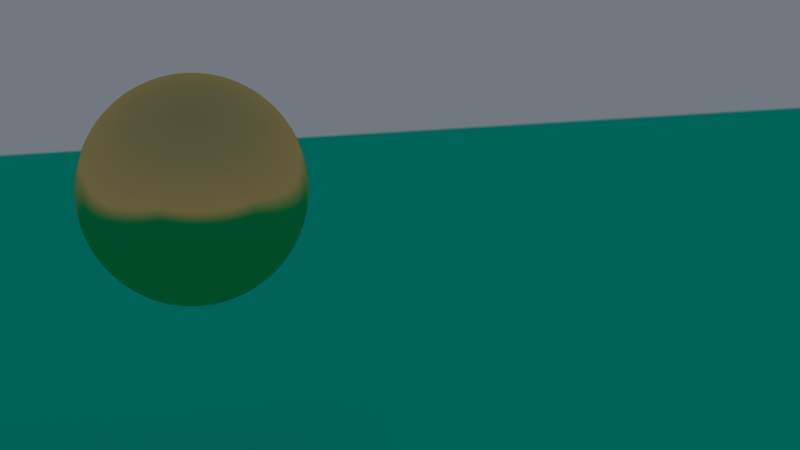
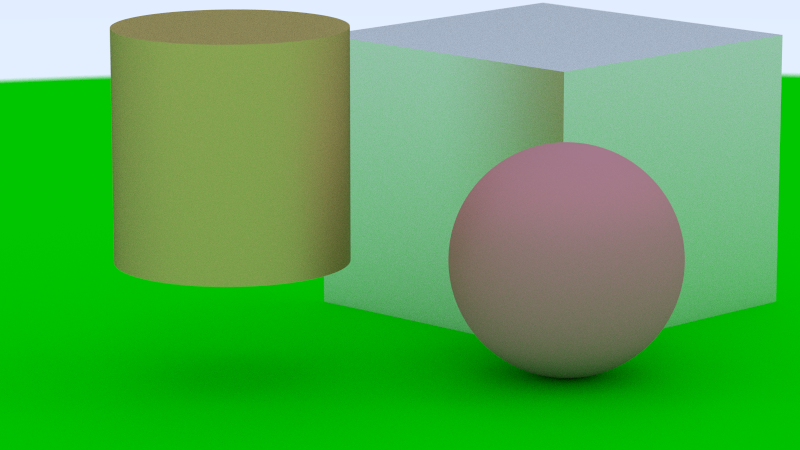
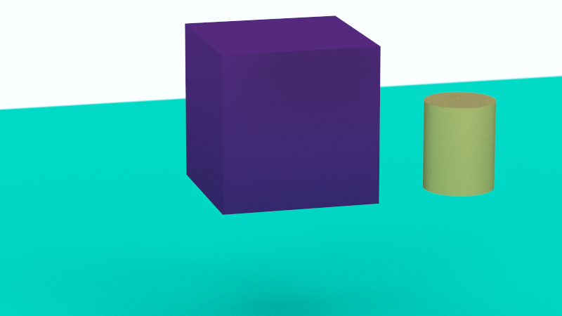
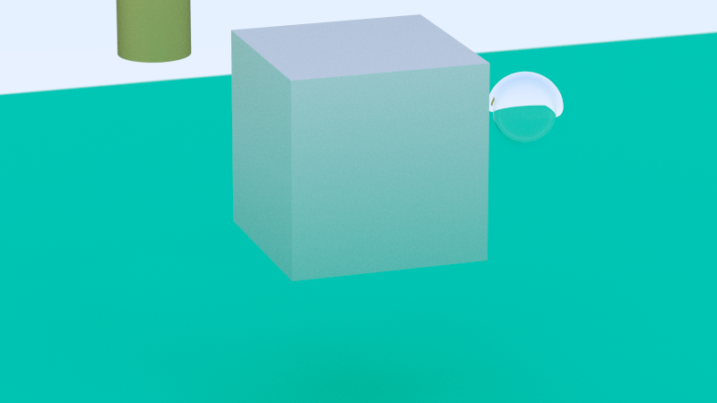

# RT

## 📝 Descriptif
Ce projet consiste à créer en `Rust` un programme qui effectue du `Ray Tracing` pour généré un image au format `.ppm` qui contiendra différentes forme géométrique (`cube`, `sphére`, `cylindre`, `plan plat`).

__Les paramétrages suivants peuvent être modifié lors de la création d'une image :__- 
- Nom du fichier image
- Taille de l'image
- Luminosité de l'image
- Position de la caméra
- Angle de vision de la camera

**Screen du paramétrage d'une image :**


**Images réalisé avec le programme**
<table align=center>
    <tr>
        <td></td>
        <td></td>
    </tr>
    <tr>
        <td></td>
        <td></td>
    </tr>
    <tr>
        <td></td>
        <td></td>
    </tr>
</table>

___
## ⚙️ Installation & usage

**Mise en route du programme**
```sh
cargo run
```

___
## 🔗 Dépendences

Le programme utilise `Rust` avec la `version 1.79.0` de [cargo](https://www.rust-lang.org/fr) et les imports suivants :<br>
- [rayon](https://docs.rs/rayon/latest/rayon/) version `1.10.0`
- [rand](https://docs.rs/rand/latest/rand/) version `0.8.5`
- [indicatif](https://docs.rs/indicatif/latest/indicatif/) version `0.17.8`

___
## 🧑‍💻 Authors
+ Fabien OLIVIER
+ Raphaël LOVERGNE 
+ Axelle FOUQUEMBERG
